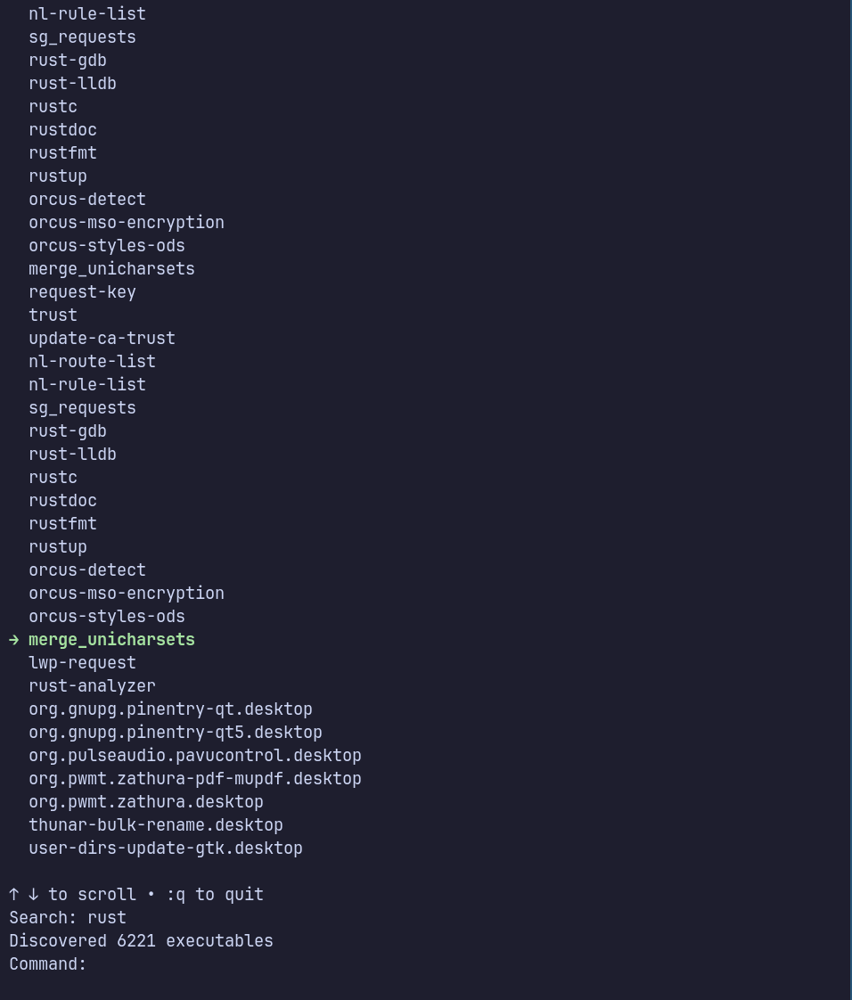

# CLI Launcher 

The CLI Launcher is an application launcher from the CLI, that allows you to search, filter and execute all Path and Desktop applications on your system.

## Features
- Scans `$PATH` and `.desktop` apps
- Fuzzy searching with arrow-key navigation
- Launch apps with Enter
- Terminal-native UI

## Usage

```sh
cargo install --git https://github.com/IskSweden/cli_launcher

cargo run --release

```

## Why?
Because i wanted to.

